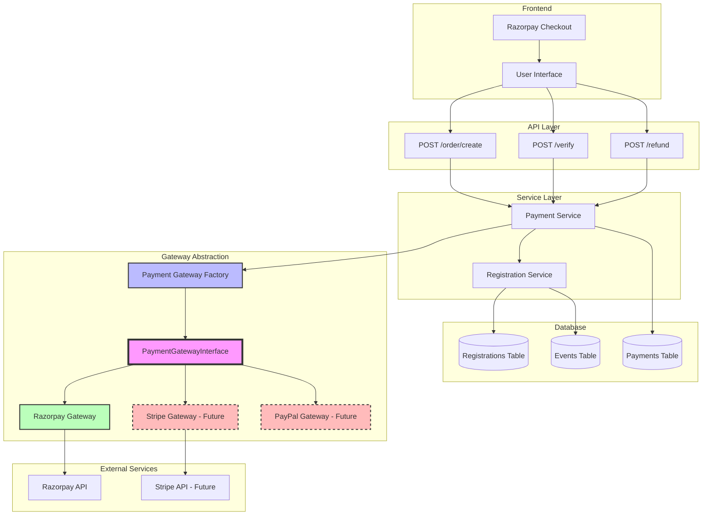
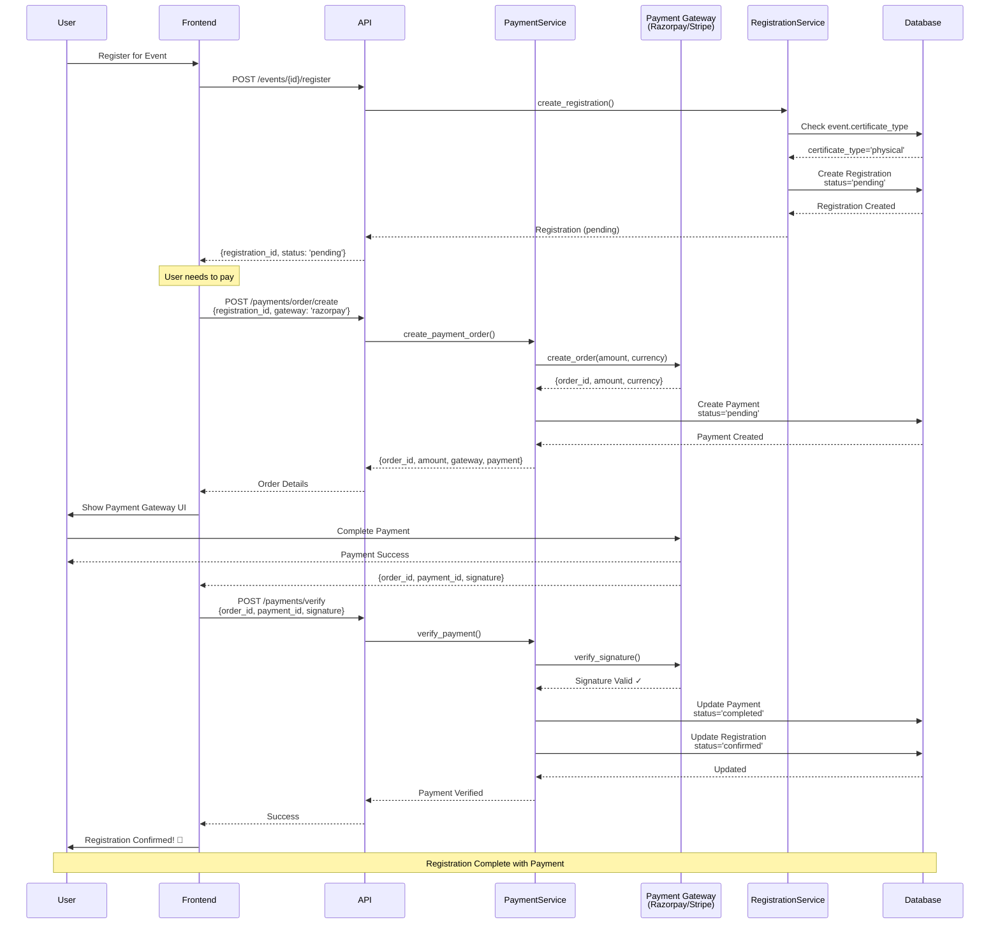
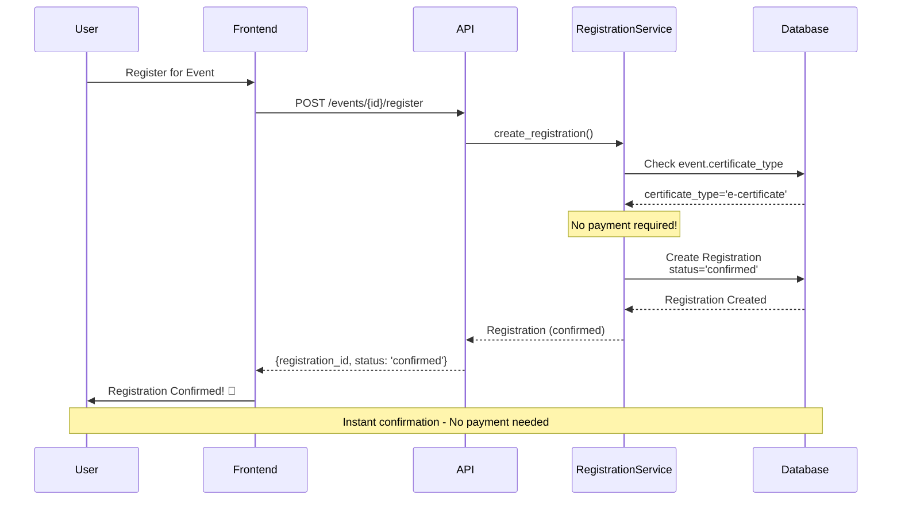
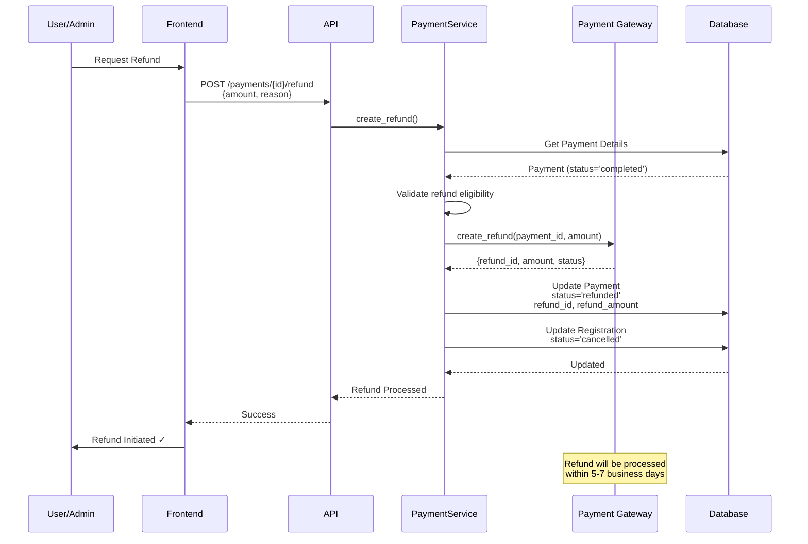
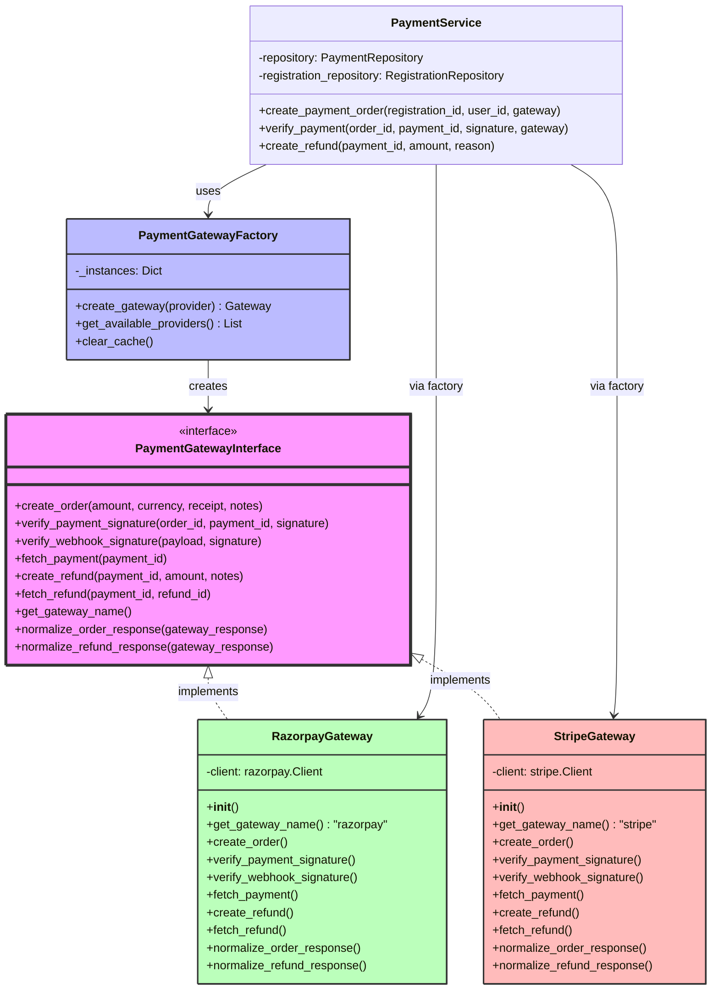
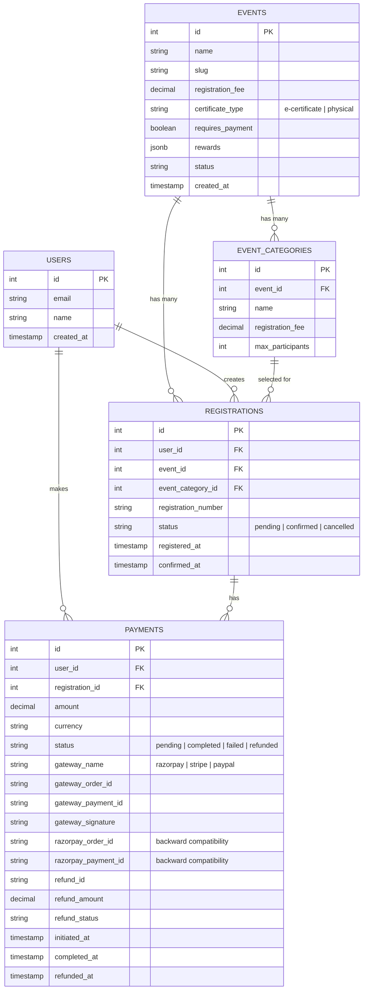
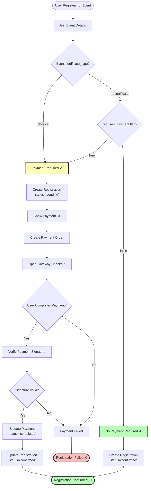
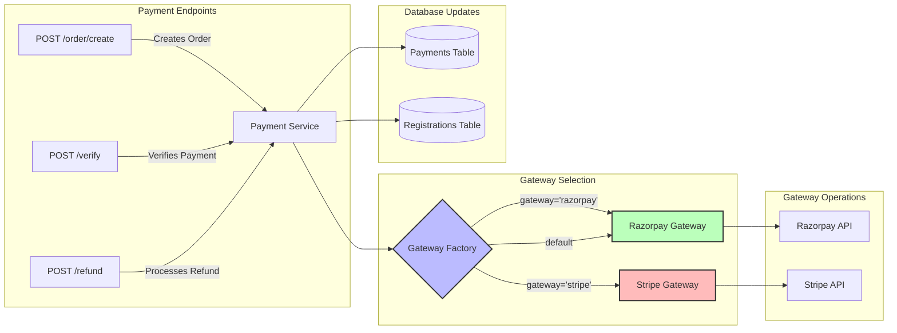
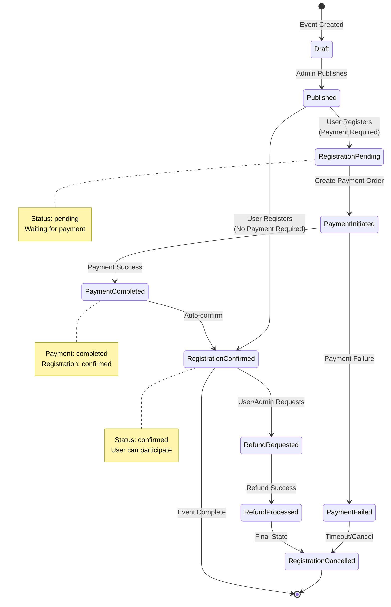

# Payment Integration - Visual Flow Diagrams

This document contains Mermaid diagrams to visualize the payment integration architecture and flows.

## Table of Contents
1. [Architecture Overview](#architecture-overview)
2. [Payment Flow - Physical Rewards](#payment-flow---physical-rewards)
3. [Payment Flow - E-Certificate](#payment-flow---e-certificate)
4. [Refund Flow](#refund-flow)
5. [Gateway Abstraction Layer](#gateway-abstraction-layer)
6. [Database Schema](#database-schema)

---

## Architecture Overview

---

## Payment Flow - Physical Rewards

---

## Payment Flow - E-Certificate

---

## Refund Flow

---

## Gateway Abstraction Layer

---

## Database Schema

---

## Decision Flow - Payment Required?

---

## API Endpoint Flow

---

## State Diagram - Registration & Payment

---

## How to Use These Diagrams

### View on Mermaid Live Editor
1. Copy any diagram code block
2. Visit [Mermaid Live Editor](https://mermaid.live)
3. Paste the code
4. View and export the diagram

### View in GitHub/GitLab
These diagrams render automatically in:
- GitHub README.md files
- GitLab documentation
- VS Code with Mermaid extension

### Export Options
From Mermaid Live Editor, you can export as:
- PNG
- SVG
- PDF
- Markdown with embedded SVG

---

## Key Insights from Diagrams

1. **Modular Architecture**: Payment gateway is abstracted, making it easy to add new providers
2. **Smart Flow**: System automatically decides if payment is needed based on event configuration
3. **State Management**: Clear state transitions for registrations and payments
4. **Provider Agnostic**: Same flow works for Razorpay, Stripe, or any future gateway
5. **Backward Compatible**: Old Razorpay-specific fields maintained alongside generic fields

---

**Generated:** April 21, 2026
**For:** GlycoGrit Backend Payment Integration
**Version:** 1.0.0
