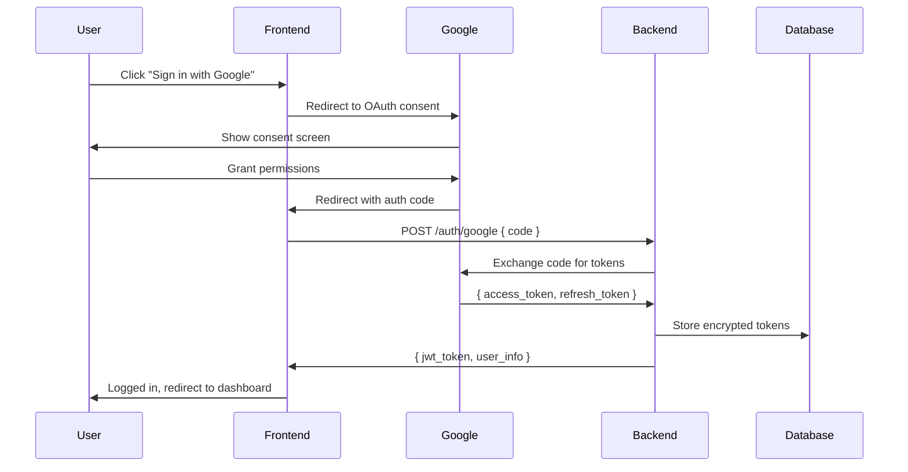
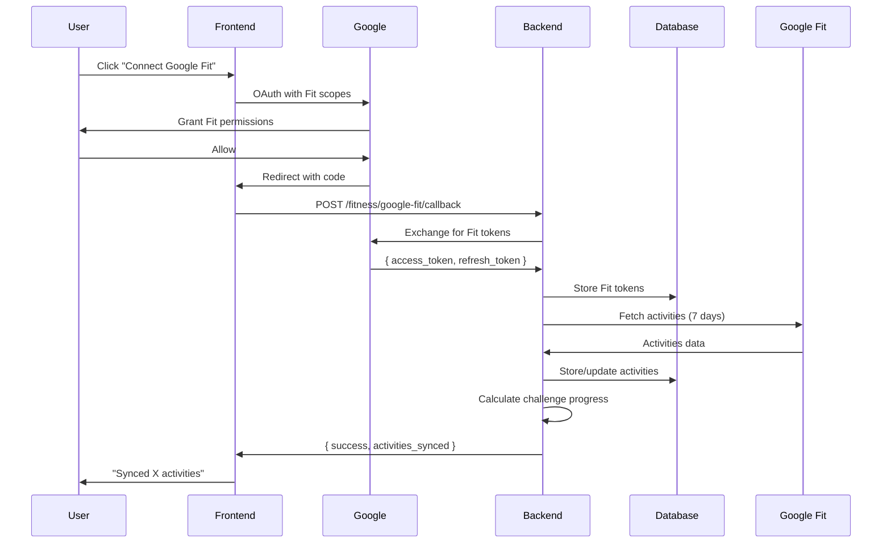
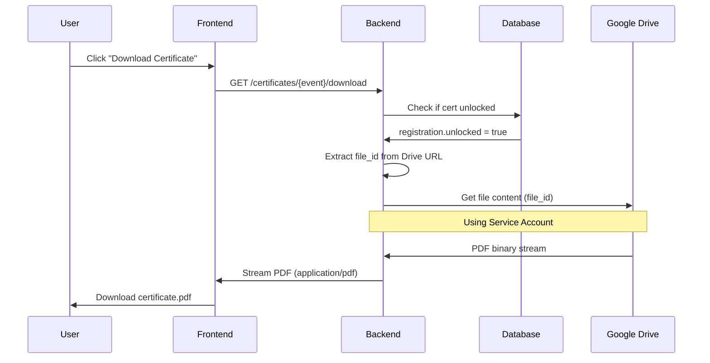

# Google Services Architecture

## System Architecture Diagram

```
┌─────────────────────────────────────────────────────────────────┐
│                         User Browser                            │
│                                                                 │
│  ┌─────────────┐    ┌──────────────┐    ┌──────────────────┐  │
│  │   Login     │    │  Dashboard   │    │  Certificate     │  │
│  │   Page      │    │  (Fit Sync)  │    │  Download        │  │
│  └──────┬──────┘    └──────┬───────┘    └────────┬─────────┘  │
└─────────┼──────────────────┼───────────────────────┼────────────┘
          │                  │                       │
          │ OAuth            │ Fit Sync              │ Download
          │                  │                       │
┌─────────▼──────────────────▼───────────────────────▼────────────┐
│                      Frontend (React)                            │
│                                                                  │
│  - Google OAuth Button                                          │
│  - Fit Sync UI                                                  │
│  - Certificate Download Link                                    │
└─────────┬──────────────────┬───────────────────────┬────────────┘
          │                  │                       │
          │ API Calls        │ API Calls             │ API Call
          │                  │                       │
┌─────────▼──────────────────▼───────────────────────▼────────────┐
│                      Backend (FastAPI)                           │
│                                                                  │
│  ┌────────────────┐  ┌──────────────────┐  ┌────────────────┐ │
│  │  OAuth Handler │  │ Fit Sync Service │  │ Drive Service  │ │
│  └────────┬───────┘  └────────┬─────────┘  └────────┬───────┘ │
│           │                   │                      │          │
│           │ Verify Token      │ Fetch Activities     │ Stream   │
│           │                   │                      │ PDF      │
└───────────┼───────────────────┼──────────────────────┼──────────┘
            │                   │                      │
            │                   │                      │
    ┌───────▼───────┐   ┌───────▼──────┐    ┌────────▼────────┐
    │               │   │              │    │                 │
    │ Google OAuth  │   │ Google Fit   │    │  Google Drive   │
    │     API       │   │     API      │    │   API (SA)      │
    │               │   │              │    │                 │
    └───────────────┘   └──────────────┘    └─────────────────┘
```

---

## Database Schema

### User Table
```sql
users
├── id (PK)
├── email
├── name
├── google_id (OAuth sub)
├── google_access_token (encrypted)
├── google_refresh_token (encrypted)
├── google_token_expires_at
├── google_fit_access_token (encrypted)
├── google_fit_refresh_token (encrypted)
└── google_fit_token_expires_at
```

### Registration Table (Certificates)
```sql
registrations
├── id (PK)
├── user_id (FK)
├── event_id (FK)
├── external_certificate_url (Drive URL)
├── external_certificate_unlocked (boolean)
├── external_certificate_uploaded_at
└── external_certificate_uploaded_by (admin_id)
```

### Activity Progress Table (Fit Data)
```sql
activity_progress
├── id (PK)
├── user_id (FK)
├── event_id (FK)
├── distance_km
├── activity_type (running, cycling, walking)
├── duration_minutes
├── calories
├── activity_date
├── sync_source (google_fit, strava, manual)
└── synced_at
```

---

## Authentication Flow (OAuth)



---

## Activity Sync Flow (Fit API)



---

## Certificate Download Flow



---

## Security Model

### Token Storage
- **OAuth tokens**: Encrypted at rest in database
- **Service account key**: Environment variable (Doppler)
- **JWT tokens**: Short-lived, signed by backend

### Access Control
- **OAuth scopes**: Limited to profile + Fit data
- **Service account**: Read-only Drive access
- **Certificate downloads**: Requires unlocked status

### API Rate Limiting
- OAuth endpoints: 10 req/min per IP
- Fit sync: Once per hour per user
- Certificate download: 5 req/min per user

---

## Code File References

### Backend

**OAuth**:
- `app/core/auth.py` - OAuth configuration
- `app/modules/auth/api/google_auth.py` - Login endpoint
- `app/modules/auth/services/auth_service.py` - Token verification

**Google Fit**:
- `app/modules/fitness/api/google_fit_api.py` - Callback endpoint
- `app/modules/fitness/services/google_fit_service.py` - Sync logic
- `app/modules/fitness/domain/activity_progress.py` - Model

**Google Drive**:
- `app/modules/certificates/services/google_drive_service.py` - Drive client
- `app/modules/certificates/api/certificates.py` - Download endpoint
- `app/modules/certificates/services/csv_processor_service.py` - URL import

### Frontend

**OAuth**:
- `src/pages/Login.tsx` - Google login button
- `src/pages/AuthCallback.tsx` - OAuth callback handler
- `src/contexts/AuthContext.tsx` - Auth state management

**Google Fit**:
- `src/pages/FitnessCallback.tsx` - Fit callback handler
- `src/components/progress/SyncCard.tsx` - Connect Fit UI
- `src/pages/Dashboard.tsx` - Displays sync status

**Certificates**:
- `src/components/features/CertificateCard.tsx` - Download button
- `src/services/certificates-api.ts` - API calls
- `src/components/admin/PostEventManagement.tsx` - Admin upload

---

## Performance Considerations

### Caching
- **OAuth tokens**: Cached in memory for 50 minutes (refresh at 55min)
- **Fit activities**: 1-hour cache to avoid excessive API calls
- **Certificate metadata**: Cached for 5 minutes

### Background Jobs
- **Token refresh**: Cronjob every hour
- **Fit sync**: Scheduled daily for active users
- **Activity cleanup**: Monthly job to remove old data

---

**Last Updated**: June 7, 2026
